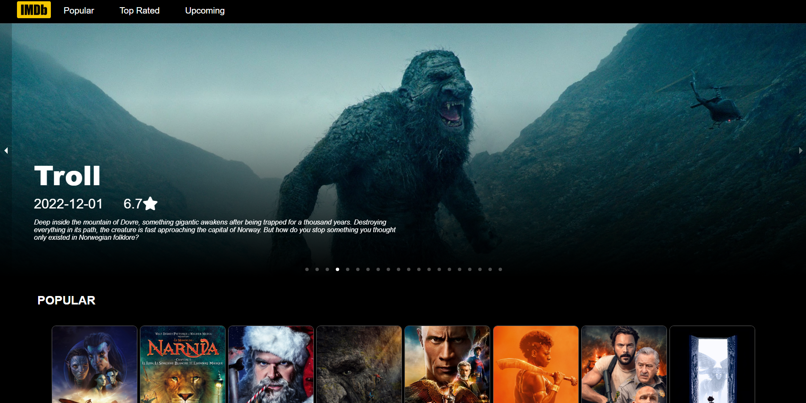
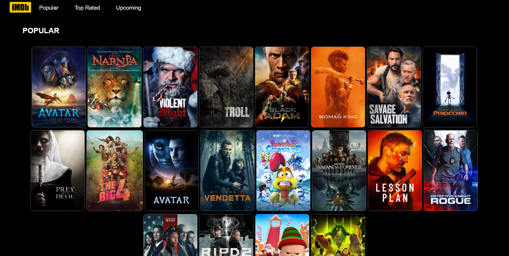
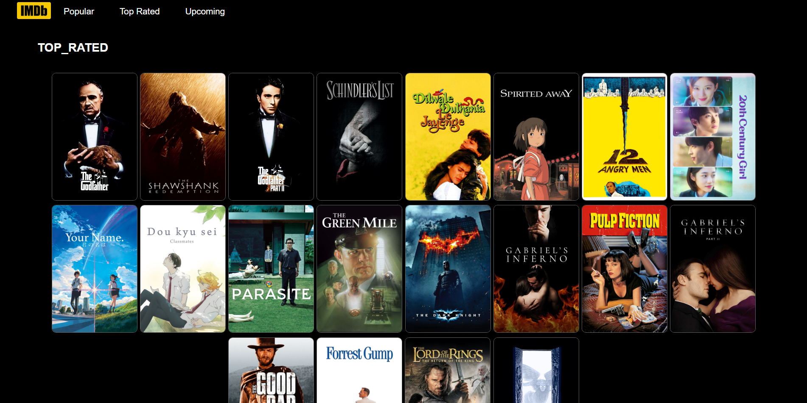
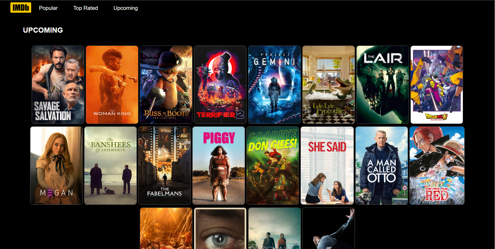

# Harry Movies App
# Movies App

This Movies App is a React-based web application that allows users to explore popular, top-rated, and upcoming movies. It also features a beautiful slider on the home page and provides detailed information about each movie.

## Features

- Home Page: The home page showcases a visually appealing slider with the latest movie releases, allowing users to get a quick glimpse of popular movies.

- Popular Movies: Users can navigate to the popular movies section to discover trending movies based on user ratings and popularity.

- Top Rated Movies: The top-rated movies section provides a curated list of highly-rated movies that have received critical acclaim.

- Upcoming Movies: Users can explore the upcoming movies section to stay updated on the latest releases and plan their movie-watching schedule accordingly.

- Movie Details: Each movie listed in the app is clickable, leading users to a dedicated movie details page. This page provides comprehensive information about the selected movie, including the plot, cast, release date, and more.

## Technologies Used

- React: A JavaScript library for building user interfaces, utilized as the core framework for this Movies App.

- CSS: Cascading Style Sheets were used to design and style the application's components, ensuring an aesthetically pleasing user interface.

- API Integration: The app integrates with an external API (e.g., The Movie Database - TMDb) to fetch movie data and display it within the application.

# Screenshot 📸
 
<h2>Home</h2>

 
 
<h2>Popular</h2>

 
 
<h2>Top Rated</h2>

 
 
<h2>Upcoming </h2>

## Contributing
   Contributions to the Movies App are welcome! If you have any ideas for improvements or bug fixes, please submit a pull request. Additionally, feel free to open issues for any feature requests or problems encountered.

## Acknowledgements
 The Movies App utilizes the API provided by The Movie Database (TMDb) to fetch movie data. Special thanks to TMDb for providing the necessary resources to develop this application.
 
## Contact
For any inquiries or questions, please contact.

Happy movie browsing! 🎬

 
<a href="https://harrymoviesapp.netlify.app/">See Website 👈</a>
 
 
